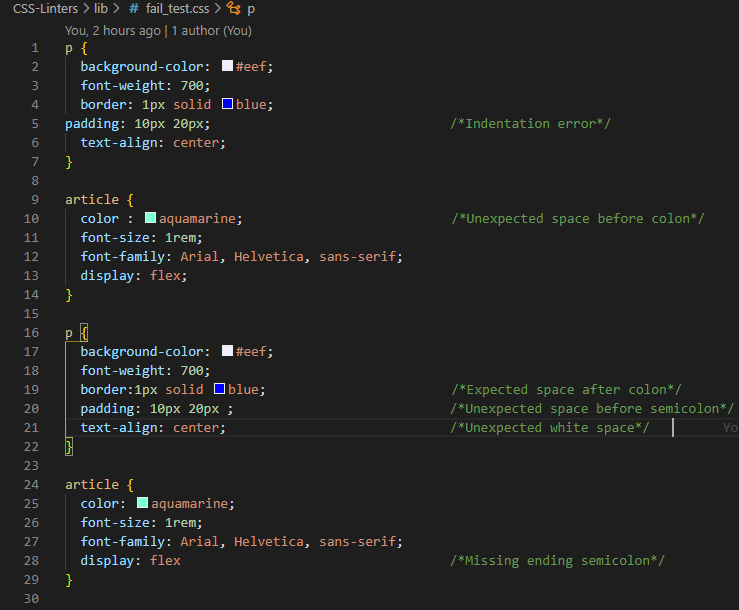
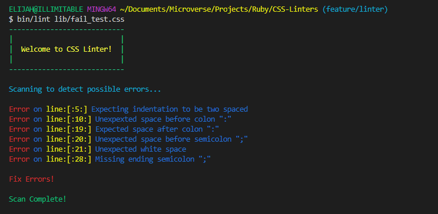

# Ruby Capstone Project - CSS Linter

[](https://github.com/ElijahTobs/CSS-Linter)
[](https://github.com/ElijahTobs/CSS-Linter/issues)
[](https://github.com/ElijahTobs/CSS-Linter/pulls)


# About 

This is a CSS Linter built completely with Ruby as @microverseinc Ruby Capstone Project. This Linter scans through CSS file(s) for errors and tells you what the error(s) is/are and how to fix it/them. Rubocop was used as a code-linter alongside Gitflow to ensure I maintain good coding standards.


# The Build
This CSS linter currently scans for the following errors/warnings.

- check for unexpected space before semicolon
- check for indentation
- check for trailing white space
- check for ending semicolon
- check for space before colon
- check for space after colon

> Below are images of 2 .css files. One passed the tests and the other failed

>> Failed Test





>> Passed Test


## Built With
- Ruby
- RSpec for Ruby Testing


# Getting Started

To get a local copy of the repository, run the following commands on your terminal:

```
$ cd <folder>
```

```
$ git clone https://github.com/ElijahTobs/CSS-Linter.git
```

## Testing

> Install **bundler**  on your system

~~~bash
$ gem install bundler 
~~~

To test the code, run `rspec` from root of the folder using terminal.

> Rspec is used for the test, to install the gem file, run

~~~bash
$ bundle install 
~~~


> or you simply install the the following directly using 

~~~bash
$ gem install rspec 
~~~

~~~bash
$ gem install colorize 
~~~

~~~bash
$ gem install rainbow
~~~

# Using The Linter

After you might have cloned the repo and installed the gems, be it manually or by using bundler, since the lint file is located inside the bin folder, on your terminal, you'll run `bin/lint` followed by the file. Using the css file in this repo as an example:
~~~bash
$ bin/lint lib/pass_test.css
~~~


# Author

👤 **Elijah Ayandokun**

- Github: [@elijahtobs](https://github.com/ElijahTobs)
- Twitter: [@elijahgr8](https://twitter.com/Elijahgr8)
- Linkedin: [ayandokunelijah](https://linkedin.com/in/ayandokunelijah)


## 🤝 Contributing

Contributions, issues and feature requests are welcome!

## Show your support

Give a ⭐️ if you like this project!

## Acknowledgments

- Project inspired by [Microverse](https://www.microverse.org)
